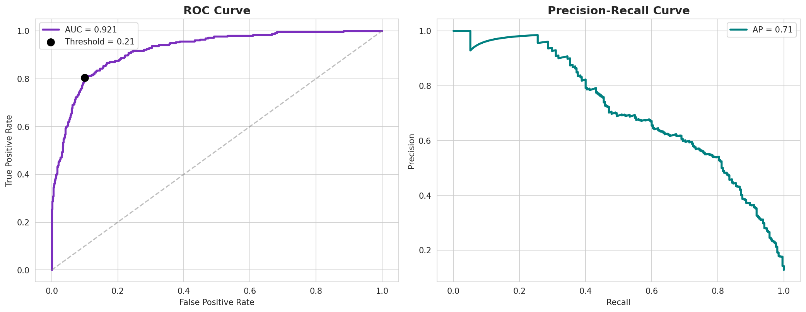
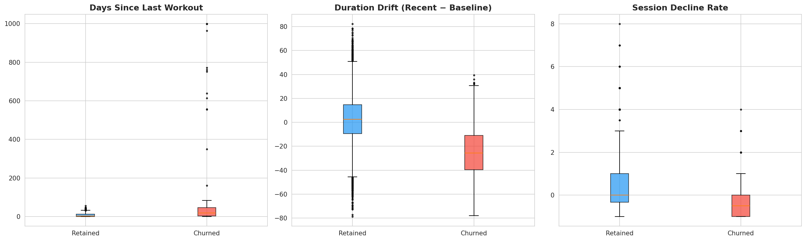
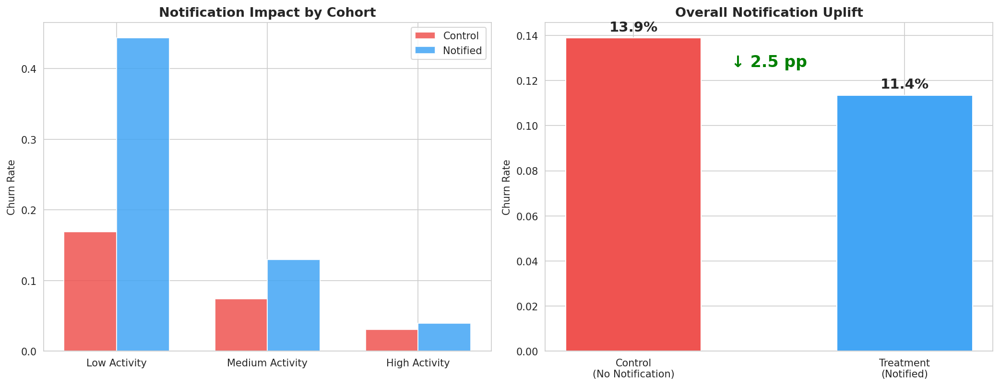

# Churn Prediction & Notification Uplift Model

**Predicting Churn Timing and Measuring Notification Impact for Long-Tenured Wellness Users**

---

## Overview

This project builds a two-model system for a wellness/fitness subscription app:

1. **Churn Prediction Model** — An XGBoost classifier that detects behavioral drift (declining session frequency, shrinking workout durations, growing inactivity gaps) to identify users likely to cancel within 30 days.
2. **Uplift Analysis** — Estimates the association between push notifications and churn reduction using **Inverse Propensity Weighting (IPW)** to adjust for confounding, with time-window enforcement on notification timing.

The analysis focuses on **long-tenured users (180+ day tenure)**, verified with an explicit assertion in code.

**Python ≥ 3.10 recommended.**

---

## Live Demo

The project includes a **Streamlit dashboard** for interactive predictions:

```bash
streamlit run app.py
```

Features:
- **Dashboard** — KPIs, risk distribution, cohort breakdown, top at-risk users
- **User Lookup** — Enter any User ID → churn probability, risk level, top factors, recommendation
- **Risk Table** — Filterable full-population risk scores

---

## Results

### Model Performance — ROC-AUC: 0.921



### Feature Importance — Drift Features Dominate


### Drift Signal — Churners vs Retained Users



### Notification Uplift — ~2.5pp Adjusted Churn Reduction

Notifications are associated with lower churn (13.9% → 11.4%), adjusted via IPW. This is an **observational estimate** — a randomized A/B test would be needed to confirm causality.



---

## Key Findings

| Metric | Value |
|--------|-------|
| Overall churn rate | 12.8% |
| Model ROC-AUC (holdout) | **0.921** |
| Top churn predictor | `days_since_last_workout` |
| Churner session decline | −0.42 vs +0.51 for retained |
| Notification association (IPW-adjusted) | **~−2.5 pp** |
| Safest cohort | Medium Activity users |
| Highest risk cohort | Low Activity users |

---

## Project Structure

```
├── app.py                              # Streamlit dashboard
├── src/
│   ├── __init__.py
│   ├── data_processing.py              # Load, clean, build base table
│   ├── feature_engineering.py          # Drift features, window aggregations
│   ├── train_model.py                  # Model training pipeline
│   └── predict.py                      # Single-user & batch predictions
├── Churn_Prediction_Model.ipynb        # Analysis notebook (imports from src/)
├── data/
│   └── agile_churn_raw_v11.xlsx        # Multi-sheet dataset (6 tables)
├── model/                               # Trained model artifacts (gitignored)
│   └── churn_model.pkl
├── docs/
│   ├── Capstone_Report_Team_3.pdf
│   └── Presentation_Team_3.pptx
├── images/                              # Result visualizations
│   ├── roc_pr_curves.png
│   ├── feature_importance.png
│   ├── drift_comparison.png
│   └── notification_uplift.png
├── requirements.txt                     # Pinned dependencies
├── .gitignore
└── README.md
```

---

## Methodology

### Drift-Based Feature Engineering

Rather than static snapshots, the model compares a user's **baseline** activity (45–90 days before decision) against their **recent** activity (last 30 days):

| Feature | Signal |
|---------|--------|
| `session_decline_rate` | Frequency decay between windows |
| `duration_drift` | Declining workout length |
| `inactivity_gap_growth` | Widening gaps between sessions |
| `calorie_trend` | Effort decline |
| `days_since_last_workout` | Immediate recency signal |

### Uplift Methodology

1. **Time-window enforcement** — Only notifications sent 7–30 days before decision date count as treatment.
2. **IPW adjustment** — Propensity scores adjust for baseline differences between treatment/control.
3. **Honest framing** — Results reported as adjusted associations, not causal effects.

---

## Setup

```bash
git clone https://github.com/yashraj10/churn-prediction-model.git
cd churn-prediction-model
pip install -r requirements.txt
```

**Run the notebook:**
```bash
jupyter notebook Churn_Prediction_Model.ipynb
```

**Run the dashboard:**
```bash
streamlit run app.py
```

---

## Dataset

| Sheet | Description |
|-------|-------------|
| `users_raw` | Demographics & decision date |
| `subscriptions_raw` | Billing & tenure |
| `sessions_raw` | Workout logs |
| `support_raw` | Support tickets |
| `notifications_raw` | Notification logs |
| `cancellations_raw` | Churn events & reasons |

## Tech Stack

- **XGBoost** — Gradient boosted tree classifier
- **SHAP** — Model explainability
- **scikit-learn** — CV, metrics, propensity scoring
- **Streamlit** — Interactive dashboard
- **pandas / NumPy** — Data wrangling
- **seaborn / matplotlib** — Visualization

## Team

Capstone Team 3 — MSDS 599

## License

This project is for academic purposes. All data is synthetic.
